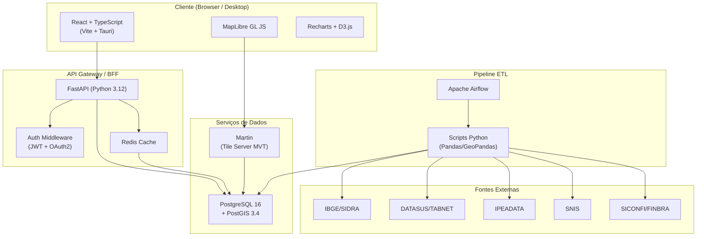
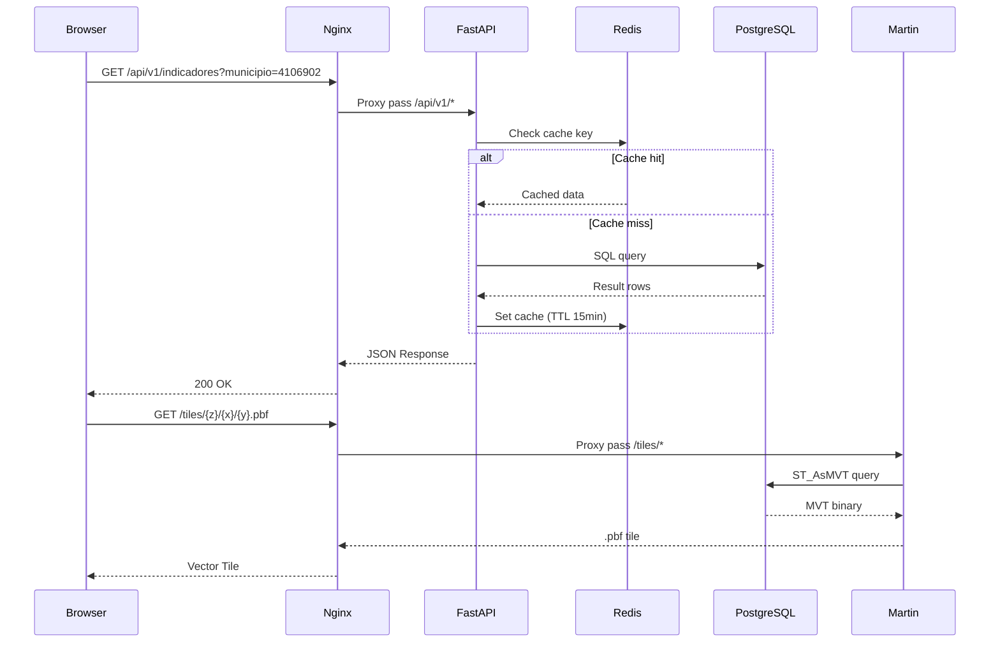
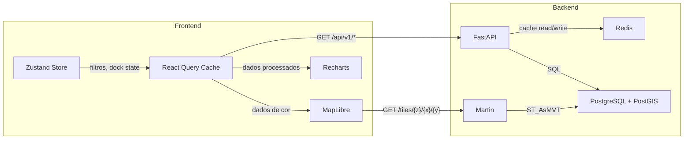

# Arquitetura do Sistema

## SisInfo / GeoIntel — V2 Enterprise-Ready

**Versão:** 2.0  
**Data:** Janeiro 2027

---

## 1. Visão Geral da Arquitetura



---

## 2. Stack Tecnológica Detalhada

### 2.1. Frontend

| Tecnologia | Versão Mínima | Propósito |
|---|---|---|
| **React** | 18.3+ | Framework de UI |
| **TypeScript** | 5.4+ | Tipagem rigorosa obrigatória |
| **Vite** | 5.x | Build tool e dev server |
| **Tauri** | 2.x | Empacotamento como app desktop (executável) |
| **MapLibre GL JS** | 4.x | Engine de mapas vetoriais (WebGL) |
| **Recharts** | 2.x | Gráficos de UI (barras, linhas, área, radar) |
| **D3.js** | 7.x | Escalas cromáticas e cálculos de cores |
| **Zustand** | 4.x | Gerenciamento de estado leve |
| **React Query (TanStack)** | 5.x | Cache de dados do servidor + revalidação |
| **Tailwind CSS** | 3.x | Estilização utility-first |
| **React Router** | 6.x | Roteamento SPA |
| **Turf.js** | 7.x | Operações geoespaciais client-side |

### 2.2. Backend

| Tecnologia | Versão Mínima | Propósito |
|---|---|---|
| **Python** | 3.12+ | Linguagem do backend |
| **FastAPI** | 0.110+ | Framework web assíncrono |
| **Uvicorn** | 0.29+ | Servidor ASGI |
| **SQLAlchemy** | 2.0+ | ORM com suporte a async |
| **GeoAlchemy2** | 0.14+ | Extensão geoespacial do SQLAlchemy |
| **Alembic** | 1.13+ | Migrações de banco de dados |
| **Pydantic** | 2.x | Validação de dados e schemas |
| **python-jose** | 3.x | Geração/validação JWT |
| **passlib** | 1.7+ | Hash de senhas (bcrypt) |
| **Redis** (via `redis-py`) | 5.x | Cache de consultas frequentes |
| **Pandas** | 2.2+ | Manipulação de dados tabulares |
| **GeoPandas** | 0.14+ | Manipulação de dados geoespaciais |

### 2.3. Banco de Dados

| Tecnologia | Versão | Propósito |
|---|---|---|
| **PostgreSQL** | 16+ | RDBMS principal |
| **PostGIS** | 3.4+ | Extensão geoespacial (geometrias, spatial queries) |

### 2.4. Tile Server

| Tecnologia | Versão | Propósito |
|---|---|---|
| **Martin** | 0.14+ | Servidor de Vector Tiles (MVT) direto do PostGIS |

### 2.5. Pipeline ETL

| Tecnologia | Versão | Propósito |
|---|---|---|
| **Apache Airflow** | 2.8+ | Orquestração de DAGs de ETL |
| **Pandas** | 2.2+ | Transformações de dados |
| **GeoPandas** | 0.14+ | Processamento de geometrias GeoJSON |
| **requests** | 2.31+ | Chamadas a APIs públicas |

### 2.6. Infraestrutura

| Tecnologia | Propósito |
|---|---|
| **Docker** | Containerização de todos os serviços |
| **Docker Compose** | Orquestração local de desenvolvimento |
| **Nginx** | Reverse proxy e servir assets estáticos |
| **GitHub Actions** | CI/CD pipeline |
| **GitHub** | Repositório de código |

---

## 3. Arquitetura de Rede e Comunicação



### 3.1. Portas e Serviços

| Serviço | Porta Interna | Porta Externa (Nginx) |
|---|---|---|
| Nginx | 80, 443 | 80, 443 |
| FastAPI (Uvicorn) | 8000 | — (proxy via /api) |
| Martin | 3000 | — (proxy via /tiles) |
| PostgreSQL | 5432 | — (não exposta) |
| Redis | 6379 | — (não exposta) |
| Airflow Webserver | 8080 | 8080 (opcional, admin only) |

---

## 4. Estrutura do Repositório

```
sisinfo-geointel/
├── .github/
│   └── workflows/
│       ├── ci.yml                 # Lint, test, build
│       └── deploy.yml             # Deploy automatizado
├── frontend/
│   ├── public/
│   ├── src/
│   │   ├── assets/                # Imagens, fontes, ícones
│   │   ├── components/            # Componentes React reutilizáveis
│   │   │   ├── common/            # Button, Card, Badge, etc.
│   │   │   ├── map/               # MapView, BottomSheet, FilterPanel
│   │   │   ├── dashboard/         # KPICard, Chart, Ranking, RadarChart
│   │   │   ├── reports/           # A4Page, KPIGrid, ReportTable
│   │   │   ├── catalog/           # DatasetCard, DataDictionary
│   │   │   ├── admin/             # CityEditor, BulkImportModal
│   │   │   └── wiki/              # DocSidebar, TOC, ProseContent
│   │   ├── hooks/                 # Custom React hooks
│   │   ├── pages/                 # Route-level components
│   │   ├── services/              # API client (axios/fetch wrappers)
│   │   ├── store/                 # Zustand stores
│   │   ├── types/                 # TypeScript interfaces/types
│   │   ├── utils/                 # Funções utilitárias (cores, escalas)
│   │   ├── styles/                # Tailwind config, globals.css
│   │   ├── App.tsx
│   │   └── main.tsx
│   ├── index.html
│   ├── vite.config.ts
│   ├── tailwind.config.ts
│   ├── tsconfig.json
│   └── package.json
├── backend/
│   ├── app/
│   │   ├── api/
│   │   │   ├── v1/
│   │   │   │   ├── endpoints/
│   │   │   │   │   ├── auth.py
│   │   │   │   │   ├── municipios.py
│   │   │   │   │   ├── indicadores.py
│   │   │   │   │   ├── datasets.py
│   │   │   │   │   ├── reports.py
│   │   │   │   │   └── admin.py
│   │   │   │   └── router.py
│   │   │   └── deps.py            # Dependências (DB, Auth)
│   │   ├── core/
│   │   │   ├── config.py          # Settings via Pydantic
│   │   │   ├── security.py        # JWT, password hashing
│   │   │   └── cache.py           # Redis client
│   │   ├── models/                # SQLAlchemy models
│   │   │   ├── municipio.py
│   │   │   ├── indicador.py
│   │   │   ├── dataset.py
│   │   │   └── user.py
│   │   ├── schemas/               # Pydantic schemas (request/response)
│   │   │   ├── municipio.py
│   │   │   ├── indicador.py
│   │   │   └── user.py
│   │   ├── services/              # Business logic
│   │   │   ├── municipio_service.py
│   │   │   ├── indicador_service.py
│   │   │   └── report_service.py
│   │   ├── db/
│   │   │   ├── session.py         # Engine + SessionLocal
│   │   │   └── init_db.py         # Seed data / initial setup
│   │   └── main.py                # FastAPI app entry
│   ├── alembic/
│   │   ├── versions/
│   │   └── env.py
│   ├── alembic.ini
│   ├── requirements.txt
│   ├── pyproject.toml
│   └── Dockerfile
├── etl/
│   ├── dags/                      # Airflow DAGs
│   │   ├── dag_ibge_sidra.py
│   │   ├── dag_datasus_tabnet.py
│   │   ├── dag_ipeadata.py
│   │   ├── dag_snis.py
│   │   └── dag_siconfi_finbra.py
│   ├── scripts/                   # Scripts de transformação
│   │   ├── extract/
│   │   ├── transform/
│   │   │   ├── melt_wide_to_long.py
│   │   │   ├── fix_ibge_code.py
│   │   │   ├── calculate_positional_index.py
│   │   │   └── clean_datasus.py
│   │   └── load/
│   ├── config/
│   │   └── sources.yaml           # Configuração declarativa das fontes
│   └── Dockerfile
├── infra/
│   ├── docker-compose.yml
│   ├── docker-compose.prod.yml
│   ├── nginx/
│   │   └── nginx.conf
│   ├── martin/
│   │   └── config.yaml
│   └── postgres/
│       └── init.sql               # Extensão PostGIS + schema inicial
├── src-tauri/                     # Configuração Tauri para app desktop
│   ├── src/
│   │   └── main.rs
│   ├── tauri.conf.json
│   └── Cargo.toml
├── .env.example
├── .gitignore
├── README.md
└── LICENSE
```

---

## 5. Padrões Arquiteturais

### 5.1. Backend — Camadas

```
Endpoint (Router) → Service (Business Logic) → Repository/Model (Data Access)
```

- **Endpoints** (`api/v1/endpoints/`) — Recebem HTTP requests, validam via Pydantic, delegam ao Service
- **Services** (`services/`) — Lógica de negócio, cálculos, agregações
- **Models** (`models/`) — SQLAlchemy ORM, representam tabelas
- **Schemas** (`schemas/`) — Pydantic models para request/response serialization

### 5.2. Frontend — Padrão de Componentes

```
Page (Route) → Layout → Feature Components → UI Primitives
```

- **Pages** — Componentes raiz de rota (`MapPage`, `DashboardPage`, `ReportPage`)
- **Feature Components** — Componentes de domínio (`BottomSheet`, `ComparisonDock`, `FilterPanel`)
- **UI Primitives** — Componentes genéricos (`Button`, `Card`, `Badge`, `Select`)

### 5.3. Gerenciamento de Estado

```
Server State (TanStack Query) ←→ Client State (Zustand)
```

- **Server State:** React Query gerencia cache, revalidação, loading/error states de dados da API
- **Client State:** Zustand para estado de UI (filtros selecionados, cidades no dock, mapa config)

---

## 6. Estratégia de Cache

### 6.1. Backend (Redis)

| Dados | TTL | Estratégia de Invalidação |
|---|---|---|
| Indicadores por município/ano | 1 hora | Invalidar por município após import |
| Resumo de KPIs (dashboard) | 30 min | Invalidar após cada ETL run |
| Metadados de datasets | 24 horas | Invalidar manualmente |
| Geometrias simplificadas | 7 dias | Invalidar após edição de geometry |

### 6.2. Frontend (React Query)

| Dados | staleTime | gcTime | Estratégia |
|---|---|---|---|
| Indicadores consultados | 5 min | 30 min | Background refetch on window focus |
| Dados de municipio detalhe | 10 min | 1 hora | Prefetch ao hover |
| Lista de datasets | 30 min | 2 horas | Refetch manual |
| Vector Tiles | Browser HTTP cache | — | Cache-Control: max-age=3600 |

---

## 7. Comunicação entre Componentes (Fluxo de Dados)



---

## 8. Deploy e Ambientes

### 8.1. Ambiente de Desenvolvimento

```yaml
# docker-compose.yml (simplificado)
services:
  postgres:
    image: postgis/postgis:16-3.4  
    ports: ["5432:5432"]
    volumes: [pgdata:/var/lib/postgresql/data]
    
  redis:
    image: redis:7-alpine
    ports: ["6379:6379"]
    
  martin:
    image: maplibre/martin:v0.14
    ports: ["3000:3000"]
    depends_on: [postgres]
    
  backend:
    build: ./backend
    ports: ["8000:8000"]
    depends_on: [postgres, redis]
    
  frontend:
    build: ./frontend
    ports: ["5173:5173"]
```

### 8.2. Ambiente de Produção

- **Nginx** como reverse proxy (SSL termination)
- **Docker Compose Prod** ou **Docker Swarm** para orquestração
- **Backup automático** do PostgreSQL (pg_dump diário)
- **Monitoramento** via logs estruturados (JSON) para integração com ferramentas existentes

### 8.3. App Desktop (Tauri)

- Empacota o frontend compilado (dist) como app nativo
- Gera executáveis para **Windows (.exe / .msi)**, **Linux (.AppImage / .deb)**, **macOS (.dmg)**
- Conecta-se ao backend remoto via API REST (configurável)
- Opção futura: bundle com backend local (SQLite mode) para uso offline
