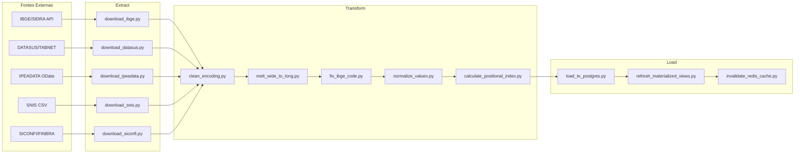

# Pipeline de Engenharia de Dados (ETL)

## SisInfo / GeoIntel — V2

**Versão:** 2.0  
**Data:** Janeiro 2027

---

## 1. Visão Geral do Pipeline



---

## 2. Orquestração com Apache Airflow

### 2.1. DAGs Planejadas

| DAG | Schedule | Fonte | Descrição |
|---|---|---|---|
| `dag_ibge_sidra` | Mensal (1º dia) | IBGE SIDRA API | Censo, PIB, população, agropecuária |
| `dag_datasus_tabnet` | Mensal (5º dia) | DATASUS TABNET | Morbidade hospitalar, indicadores de saúde |
| `dag_ipeadata` | Semanal (dom) | IPEADATA OData API | Indicadores macroeconômicos municipais |
| `dag_snis` | Trimestral | SNIS downloads | Saneamento básico |
| `dag_siconfi_finbra` | Mensal (10º dia) | SICONFI/STN | Finanças públicas municipais |
| `dag_geometrias` | Anual | IBGE geoftp | Malhas municipais GeoJSON |
| `dag_pos_processamento` | Diário (após ETL) | PostgreSQL | Cálculo de índice posicional + refresh views |

### 2.2. Estrutura de DAG (Template)

```python
# etl/dags/dag_ibge_sidra.py
from airflow import DAG
from airflow.operators.python import PythonOperator
from datetime import datetime, timedelta

default_args = {
    'owner': 'geointel-etl',
    'depends_on_past': False,
    'email_on_failure': True,
    'email': ['admin@geointel.gov.br'],
    'retries': 3,
    'retry_delay': timedelta(minutes=5),
}

with DAG(
    'dag_ibge_sidra',
    default_args=default_args,
    description='Ingestão de dados do IBGE/SIDRA',
    schedule_interval='0 3 1 * *',  # 1º dia de cada mês, 3h
    start_date=datetime(2027, 1, 1),
    catchup=False,
    tags=['ibge', 'etl', 'mensal'],
) as dag:

    extract = PythonOperator(
        task_id='extract_ibge',
        python_callable='scripts.extract.download_ibge.run',
    )

    transform = PythonOperator(
        task_id='transform_ibge',
        python_callable='scripts.transform.process_ibge.run',
    )

    validate = PythonOperator(
        task_id='validate_data',
        python_callable='scripts.transform.validate_output.run',
    )

    load = PythonOperator(
        task_id='load_to_postgres',
        python_callable='scripts.load.load_to_postgres.run',
    )

    refresh_views = PythonOperator(
        task_id='refresh_materialized_views',
        python_callable='scripts.load.refresh_views.run',
    )

    invalidate_cache = PythonOperator(
        task_id='invalidate_redis_cache',
        python_callable='scripts.load.invalidate_cache.run',
    )

    extract >> transform >> validate >> load >> refresh_views >> invalidate_cache
```

---

## 3. Scripts de Extração (Extract)

### 3.1. IBGE/SIDRA

```python
# etl/scripts/extract/download_ibge.py
"""
Baixa dados do IBGE via API SIDRA.
Tabelas-alvo: 
  - 6579 (PIB municipal)
  - 4714 (População estimada)
  - 1301 (Censo agropecuário)
"""
import requests
import pandas as pd
from pathlib import Path

SIDRA_BASE = "https://apisidra.ibge.gov.br/values"
TABLES = {
    "pib_municipal": "/t/6579/n6/all/v/37/p/last",
    "populacao_estimada": "/t/4714/n6/all/v/93/p/last",
}

def run(**context):
    output_dir = Path("/tmp/etl/raw/ibge")
    output_dir.mkdir(parents=True, exist_ok=True)
    
    for name, endpoint in TABLES.items():
        response = requests.get(f"{SIDRA_BASE}{endpoint}", timeout=120)
        response.raise_for_status()
        data = response.json()
        
        df = pd.DataFrame(data[1:], columns=[h['id'] for h in data[0].values()])
        df.to_csv(output_dir / f"{name}.csv", index=False, encoding='utf-8')
```

### 3.2. IPEADATA (API OData em lotes)

```python
# etl/scripts/extract/download_ipeadata.py
"""
Baixa dados do IPEADATA via API OData com ThreadPoolExecutor.
Endpoint: http://www.ipeadata.gov.br/api/odata4/
"""
import requests
import pandas as pd
from concurrent.futures import ThreadPoolExecutor, as_completed

IPEADATA_BASE = "http://www.ipeadata.gov.br/api/odata4/ValoresSerie(SERCODIGO='{code}')"
SERIES_CODES = [
    "PIBMpc",        # PIB municipal per capita
    "EMPREGO",       # Emprego formal
    "RFPC",          # Renda familiar per capita
]

def fetch_serie(code: str) -> pd.DataFrame:
    url = IPEADATA_BASE.format(code=code)
    resp = requests.get(url, timeout=60)
    data = resp.json()["value"]
    df = pd.DataFrame(data)
    df["SERCODIGO"] = code
    return df

def run(**context):
    results = []
    with ThreadPoolExecutor(max_workers=4) as executor:
        futures = {executor.submit(fetch_serie, code): code for code in SERIES_CODES}
        for future in as_completed(futures):
            df = future.result()
            # Filtrar apenas municípios
            df = df[df["NIVNOME"] == "Municípios"]
            results.append(df)
    
    df_all = pd.concat(results, ignore_index=True)
    df_all.to_csv("/tmp/etl/raw/ipeadata/consolidado.csv", index=False)
```

### 3.3. DATASUS/TABNET

```python
# etl/scripts/extract/download_datasus.py
"""
Processa exportações do TABNET (CSV com anos como colunas).
Requer download manual ou scraping do portal DATASUS.
"""

def run(**context):
    # DATASUS não possui API REST confiável.
    # Opção 1: Download manual dos CSVs e armazenamento em /data/raw/datasus/
    # Opção 2: Scraping automatizado via Selenium (complexo, frágil)
    # Recomendação: Download manual trimestral + validação automática
    pass
```

---

## 4. Scripts de Transformação (Transform)

### 4.1. Limpeza de Encoding

```python
# etl/scripts/transform/clean_encoding.py
import pandas as pd

def clean_dataframe(df: pd.DataFrame, source: str) -> pd.DataFrame:
    """Normaliza encoding e valores ausentes."""
    
    # Tratamento de ausentes por fonte
    MISSING_MARKERS = {
        "ibge": ["...", "X", "-", ".."],
        "datasus": ["-", "..."],
        "snis": ["", " "],
    }
    
    markers = MISSING_MARKERS.get(source, ["-"])
    for col in df.columns:
        df[col] = df[col].replace(markers, pd.NA)
    
    # Substituir vírgula decimal por ponto
    for col in df.select_dtypes(include='object').columns:
        df[col] = df[col].str.replace(',', '.', regex=False)
    
    return df
```

### 4.2. Melt (Wide to Long)

```python
# etl/scripts/transform/melt_wide_to_long.py
import pandas as pd

def melt_indicadores(
    df: pd.DataFrame,
    id_vars: list[str],
    value_vars: list[str],
    var_name: str = "Nome_Indicador",
    value_name: str = "Valor"
) -> pd.DataFrame:
    """
    Converte formato "largo" (indicadores como colunas)
    para formato "longo" (uma linha por observação).
    
    Usado para: SNIS, DATASUS, FINBRA
    """
    df_long = pd.melt(
        df,
        id_vars=id_vars,
        value_vars=value_vars,
        var_name=var_name,
        value_name=value_name
    )
    
    # Converter valor para numérico
    df_long[value_name] = pd.to_numeric(df_long[value_name], errors='coerce')
    
    return df_long.dropna(subset=[value_name])
```

### 4.3. Correção de Código IBGE (6 → 7 dígitos)

```python
# etl/scripts/transform/fix_ibge_code.py
import pandas as pd

def build_correction_dict(municipios_path: str) -> dict[str, str]:
    """
    Constrói dicionário O(1) de 6→7 dígitos a partir do 
    cadastro homologado de municípios.
    """
    df = pd.read_csv(municipios_path, sep=';', dtype=str)
    return {row['Codigo_Municipio'][:6]: row['Codigo_Municipio'] 
            for _, row in df.iterrows()}

def fix_codes(df: pd.DataFrame, col: str, correction_dict: dict) -> pd.DataFrame:
    """
    Corrige códigos IBGE truncados (6 dígitos → 7 dígitos).
    DEVE ser executado ANTES do cálculo do Índice Posicional.
    """
    def correct(code):
        code = str(code).strip()
        if len(code) == 7:
            return code
        elif len(code) >= 6:
            prefix = code[:6]
            return correction_dict.get(prefix, None)
        return None
    
    df[col] = df[col].apply(correct)
    
    # Reportar não-corrigidos
    invalid = df[df[col].isna()]
    if len(invalid) > 0:
        print(f"⚠️ {len(invalid)} códigos IBGE não corrigidos")
    
    return df.dropna(subset=[col])
```

### 4.4. Cálculo do Índice Posicional

```python
# etl/scripts/transform/calculate_positional_index.py
import pandas as pd

def calculate_positional_index(
    df: pd.DataFrame,
    indicadores_config: dict[str, bool]  # {"PIB per Capita": True, "Mortalidade": False}
) -> pd.DataFrame:
    """
    Calcula o Índice Posicional normalizado (0–1) para cada 
    indicador×ano, permitindo comparações justas no mapa coroplético.
    
    Lógica:
    - Determinar direção (maior_melhor)
    - Rankear com método 'average' para empates
    - Fórmula: IP = (N - rank) / (N - 1)
    
    MANDATÓRIO antes de inserir na aplicação.
    """
    results = []
    
    for (indicador, ano), grupo in df.groupby(['Nome_Indicador', 'Ano_Observacao']):
        N = len(grupo)
        if N <= 1:
            grupo['Indice_Posicional'] = 0.5  # Valor neutro para singleton
            results.append(grupo)
            continue
        
        maior_melhor = indicadores_config.get(indicador, True)
        
        # Rank ascendente se NÃO é maior_melhor (ex: mortalidade)
        grupo = grupo.copy()
        grupo['rank'] = grupo['Valor'].rank(
            method='average', 
            ascending=(not maior_melhor)
        )
        grupo['Indice_Posicional'] = (N - grupo['rank']) / (N - 1)
        
        # Clamp entre 0 e 1
        grupo['Indice_Posicional'] = grupo['Indice_Posicional'].clip(0, 1)
        
        results.append(grupo.drop(columns=['rank']))
    
    return pd.concat(results, ignore_index=True)
```

### 4.5. Processamento Específico por Fonte

#### DATASUS (TABNET)
```python
# etl/scripts/transform/clean_datasus.py
import pandas as pd
import re

def process_datasus(df_raw: pd.DataFrame) -> pd.DataFrame:
    """
    1. Limpa marcadores de ausência ('-' → 0)
    2. Melt dos anos (colunas → linhas)
    3. Split de string do município ("410010 Abatiá" → "410010")
    4. Substituição de vírgula decimal
    """
    # Step 1: Limpar ausentes
    df = df_raw.replace('-', 0)
    
    # Step 2: Identificar colunas de anos (formato '2010', '2011', etc.)
    year_cols = [c for c in df.columns if re.match(r'^\d{4}$', str(c))]
    id_cols = [c for c in df.columns if c not in year_cols]
    
    df_long = pd.melt(df, id_vars=id_cols, value_vars=year_cols,
                       var_name='Ano_Observacao', value_name='Valor')
    
    # Step 3: Extrair código IBGE de string concatenada
    if 'Município' in df_long.columns:
        df_long['Codigo_Municipio'] = df_long['Município'].str.extract(r'(\d{6,7})')
    
    # Step 4: Normalizar valores
    df_long['Valor'] = df_long['Valor'].astype(str).str.replace(',', '.', regex=False)
    df_long['Valor'] = pd.to_numeric(df_long['Valor'], errors='coerce')
    df_long['Ano_Observacao'] = pd.to_numeric(df_long['Ano_Observacao'])
    
    return df_long
```

#### FINBRA/SICONFI
```python
# etl/scripts/transform/clean_finbra.py
import pandas as pd

def process_finbra(filepath: str, ano: int) -> pd.DataFrame:
    """
    Parser rigoroso para FINBRA/SICONFI:
    - skiprows=3 (cabeçalho proprietário)
    - encoding latin1
    - Concatenar 'Conta' + 'Coluna' para Nome_Indicador
    """
    df = pd.read_csv(filepath, sep=';', encoding='latin-1', skiprows=3)
    
    # Gerar indicador unívoco
    df['Nome_Indicador'] = df['Conta'].astype(str) + ' - ' + df['Coluna'].astype(str)
    df['Ano_Observacao'] = ano
    
    # Normalizar valores monetários
    if 'Valor' in df.columns:
        df['Valor'] = df['Valor'].astype(str).str.replace('.', '', regex=False)
        df['Valor'] = df['Valor'].str.replace(',', '.', regex=False)
        df['Valor'] = pd.to_numeric(df['Valor'], errors='coerce')
    
    return df[['Codigo_Municipio', 'Nome_Indicador', 'Ano_Observacao', 'Valor']].dropna()
```

---

## 5. Scripts de Carga (Load)

### 5.1. Carga no PostgreSQL

```python
# etl/scripts/load/load_to_postgres.py
import pandas as pd
from sqlalchemy import create_engine
from sqlalchemy.dialects.postgresql import insert

def load_indicador_valores(df: pd.DataFrame, engine):
    """
    Upsert de valores de indicadores no PostgreSQL.
    Usa INSERT...ON CONFLICT para idempotência.
    """
    table = 'geointel.indicador_valores'
    
    # Mapear Nome_Indicador → indicador_id
    indicadores = pd.read_sql(
        "SELECT id, nome FROM geointel.indicadores", engine
    )
    nome_to_id = dict(zip(indicadores['nome'], indicadores['id']))
    
    df['indicador_id'] = df['Nome_Indicador'].map(nome_to_id)
    df = df.dropna(subset=['indicador_id'])
    df['indicador_id'] = df['indicador_id'].astype(int)
    
    # Inserir com upsert
    records = df[['codigo_ibge', 'indicador_id', 'ano', 'valor', 'indice_posicional']].rename(
        columns={'ano': 'ano', 'valor': 'valor'}
    ).to_dict('records')
    
    stmt = insert(table).values(records)
    stmt = stmt.on_conflict_do_update(
        constraint='uk_indicador_valor',
        set_={'valor': stmt.excluded.valor, 
              'indice_posicional': stmt.excluded.indice_posicional,
              'updated_at': 'NOW()'}
    )
    
    with engine.begin() as conn:
        conn.execute(stmt)
```

### 5.2. Carga de Geometrias

```python
# etl/scripts/load/load_geometrias.py
import geopandas as gpd
from sqlalchemy import create_engine

def load_geojson(geojson_path: str, engine):
    """
    Carrega GeoJSON de malhas municipais no PostGIS.
    Propriedade chave: CD_MUN (código IBGE 7 dígitos).
    """
    gdf = gpd.read_file(geojson_path)
    
    # Garantir SRID 4326
    if gdf.crs is None or gdf.crs.to_epsg() != 4326:
        gdf = gdf.to_crs(epsg=4326)
    
    # Renomear propriedade chave
    gdf = gdf.rename(columns={'CD_MUN': 'codigo_ibge'})
    
    # Simplificar geometria para zoom out (~0.005 graus ≈ 500m)
    gdf['geom_simplified'] = gdf.geometry.simplify(0.005, preserve_topology=True)
    
    # Salvar no PostGIS
    gdf[['codigo_ibge', 'geometry']].to_postgis(
        'municipio_geometrias', engine, schema='geointel',
        if_exists='replace', index=False
    )
```

---

## 6. Validação de Dados

### 6.1. Checklist de Validação Pré-Load

| Verificação | Tipo | Ação se Falhar |
|---|---|---|
| Códigos IBGE com 7 dígitos | Formato | Aplicar correção 6→7 |
| Códigos IBGE existentes no cadastro | Integridade | Descartar + log |
| Valores numéricos (não NaN) | Tipo | Descartar + log |
| Anos dentro do range (1980–2030) | Range | Descartar + log |
| Duplicatas (município × indicador × ano) | Unicidade | Manter último valor |
| Outliers extremos (Z-score > 5) | Estatístico | Flaggar para revisão manual |

### 6.2. Script de Validação

```python
# etl/scripts/transform/validate_output.py
import pandas as pd
import numpy as np

def validate(df: pd.DataFrame, municipios_validos: set[str]) -> tuple[pd.DataFrame, dict]:
    """Valida DataFrame antes do load. Retorna (df_limpo, report)."""
    report = {'total': len(df), 'erros': {}}
    
    # 1. Código IBGE válido
    mask_ibge = df['Codigo_Municipio'].isin(municipios_validos)
    report['erros']['ibge_invalido'] = (~mask_ibge).sum()
    
    # 2. Valor numérico
    mask_valor = df['Valor'].notna() & np.isfinite(df['Valor'])
    report['erros']['valor_invalido'] = (~mask_valor).sum()
    
    # 3. Ano válido
    mask_ano = df['Ano_Observacao'].between(1980, 2030)
    report['erros']['ano_invalido'] = (~mask_ano).sum()
    
    # 4. Outliers (Z-score por indicador)
    def flag_outliers(group):
        z = (group['Valor'] - group['Valor'].mean()) / group['Valor'].std()
        return z.abs() <= 5
    
    mask_outlier = df.groupby('Nome_Indicador', group_keys=False).apply(flag_outliers)
    report['erros']['outliers'] = (~mask_outlier).sum()
    
    # Aplicar filtros
    df_clean = df[mask_ibge & mask_valor & mask_ano & mask_outlier].copy()
    
    # 5. Remover duplicatas (manter última)
    n_before = len(df_clean)
    df_clean = df_clean.drop_duplicates(
        subset=['Codigo_Municipio', 'Nome_Indicador', 'Ano_Observacao'],
        keep='last'
    )
    report['erros']['duplicatas'] = n_before - len(df_clean)
    
    report['registros_validos'] = len(df_clean)
    return df_clean, report
```

---

## 7. Configuração Declarativa de Fontes

```yaml
# etl/config/sources.yaml
sources:
  ibge_sidra:
    nome: "IBGE/SIDRA"
    tipo: "api_rest"
    base_url: "https://apisidra.ibge.gov.br/values"
    encoding: "utf-8"
    separator: ","
    schedule: "0 3 1 * *"
    tabelas:
      - id: 6579
        nome: "PIB Municipal"
        indicador: "PIB per Capita"
        categoria: "Economia"
        maior_melhor: true
      - id: 4714
        nome: "População Estimada"
        indicador: "População"
        categoria: "Demografia"
        maior_melhor: false
        
  datasus_tabnet:
    nome: "DATASUS/TABNET"
    tipo: "csv_manual"
    encoding: "latin-1"
    separator: ";"
    schedule: "0 3 5 * *"
    tratamentos:
      - replace_missing: ["-", "..."]
      - melt_years: true
      - split_municipio_code: true
      
  ipeadata:
    nome: "IPEADATA"
    tipo: "api_odata"
    base_url: "http://www.ipeadata.gov.br/api/odata4/"
    encoding: "utf-8"
    schedule: "0 3 * * 0"
    filtros:
      - campo: "NIVNOME"
        valor: "Municípios"
        
  snis:
    nome: "SNIS"
    tipo: "csv_download"
    encoding: "latin-1"
    separator: ";"
    schedule: "0 3 1 */3 *"
    tratamentos:
      - melt_wide: true
      
  siconfi_finbra:
    nome: "SICONFI/FINBRA"
    tipo: "csv_download"
    encoding: "latin-1"
    separator: ";"
    skip_rows: 3
    schedule: "0 3 10 * *"
    tratamentos:
      - concat_conta_coluna: true
```

---

## 8. Monitoramento e Alertas

| Evento | Ação | Canal |
|---|---|---|
| DAG falhou após 3 retries | Email para admin | email |
| >5% de registros com erros | Log de warning + flag no banco | audit_log |
| Fonte externa indisponível (timeout) | Retry exponencial + alerta | email |
| Schema da fonte mudou (colunas inesperadas) | Pausa DAG + alerta crítico | email + slack |
| Refresh de materialized view falhou | Email + fallback para view anterior | email |
