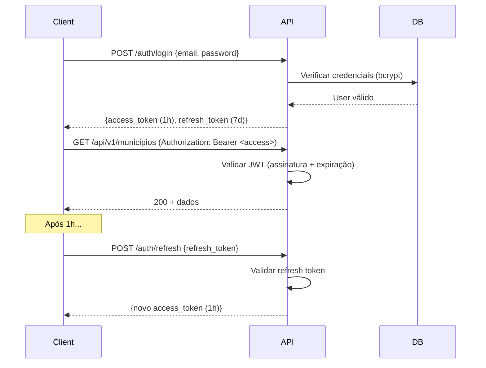

# Segurança, Autenticação e Autorização

## SisInfo / GeoIntel — V2

---

## 1. Modelo de Autenticação

### 1.1. Fluxo JWT (Access + Refresh)



### 1.2. Configuração JWT

| Parâmetro | Valor | Armazenamento |
|---|---|---|
| Algoritmo | HS256 (ou RS256 para multi-serviço) | — |
| Access Token TTL | 1 hora | `localStorage` ou memory |
| Refresh Token TTL | 7 dias | `httpOnly cookie` (preferido) |
| Segredo JWT | Variável de ambiente `JWT_SECRET` | `.env` (nunca no código) |
| Payload claims | `sub` (user_id), `email`, `roles`, `exp`, `iat` | — |

### 1.3. Hashing de Senha

```python
# core/security.py
from passlib.context import CryptContext

pwd_context = CryptContext(schemes=["bcrypt"], deprecated="auto")

def hash_password(password: str) -> str:
    return pwd_context.hash(password)

def verify_password(plain: str, hashed: str) -> bool:
    return pwd_context.verify(plain, hashed)
```

---

## 2. RBAC (Role-Based Access Control)

### 2.1. Matriz de Permissões

| Recurso / Ação | VIEWER | ANALYST | ADMIN |
|---|---|---|---|
| **Mapa** — Visualizar | ✅ | ✅ | ✅ |
| **Mapa** — Filtrar/Interagir | ✅ | ✅ | ✅ |
| **Dashboard** — Visualizar | ✅ | ✅ | ✅ |
| **Dashboard** — Comparação (Dock) | ❌ | ✅ | ✅ |
| **Relatórios** — Visualizar | ✅ | ✅ | ✅ |
| **Relatórios** — Exportar PDF | ❌ | ✅ | ✅ |
| **Catalog** — Visualizar | ✅ | ✅ | ✅ |
| **Catalog** — Download RAW | ❌ | ✅ | ✅ |
| **Catalog** — API Docs | ❌ | ✅ | ✅ |
| **Admin** — City Editor | ❌ | ❌ | ✅ |
| **Admin** — Bulk Import | ❌ | ❌ | ✅ |
| **Admin** — Gerenciar Usuários | ❌ | ❌ | ✅ |
| **Wiki** — Ler | ✅ | ✅ | ✅ |
| **Wiki** — Editar | ❌ | ❌ | ✅ |

### 2.2. Middleware de Autorização (FastAPI)

```python
# api/deps.py
from fastapi import Depends, HTTPException, status
from fastapi.security import HTTPBearer, HTTPAuthorizationCredentials
from jose import JWTError, jwt

security = HTTPBearer()

async def get_current_user(
    credentials: HTTPAuthorizationCredentials = Depends(security),
    db: AsyncSession = Depends(get_db)
) -> User:
    try:
        payload = jwt.decode(credentials.credentials, JWT_SECRET, algorithms=["HS256"])
        user_id = payload.get("sub")
    except JWTError:
        raise HTTPException(status_code=401, detail="Token inválido ou expirado")
    
    user = await db.get(User, user_id)
    if not user or not user.ativo:
        raise HTTPException(status_code=401, detail="Usuário não encontrado ou inativo")
    return user

def require_role(*roles: str):
    """Dependency que exige uma ou mais roles."""
    async def check_role(user: User = Depends(get_current_user)):
        user_roles = {r.nome for r in user.roles}
        if not user_roles.intersection(roles):
            raise HTTPException(
                status_code=403, 
                detail=f"Acesso restrito. Roles necessárias: {roles}"
            )
        return user
    return check_role

# Uso nos endpoints:
# @router.post("/admin/import/bulk")
# async def bulk_import(user: User = Depends(require_role("ADMIN"))):
```

---

## 3. Proteções de API

### 3.1. Rate Limiting

```python
# core/rate_limit.py
from slowapi import Limiter, _rate_limit_exceeded_handler
from slowapi.util import get_remote_address

limiter = Limiter(key_func=get_remote_address, storage_uri="redis://redis:6379/1")

# Aplicar no app:
# app.state.limiter = limiter
# app.add_exception_handler(RateLimitExceeded, _rate_limit_exceeded_handler)

# Uso:
# @router.get("/municipios")
# @limiter.limit("120/minute")
# async def list_municipios(request: Request):
```

### 3.2. CORS

```python
# main.py
from fastapi.middleware.cors import CORSMiddleware

app.add_middleware(
    CORSMiddleware,
    allow_origins=settings.CORS_ORIGINS.split(","),
    allow_credentials=True,
    allow_methods=["GET", "POST", "PUT", "DELETE"],
    allow_headers=["*"],
)
```

### 3.3. Validação de Input

- **Pydantic** valida automaticamente todos os inputs via schemas
- **SQL Injection:** Prevenido pelo uso de SQLAlchemy ORM (queries parametrizadas)
- **XSS:** Frontend sanitiza inputs; API retorna JSON (não HTML)
- **CSRF:** Mitigado por JWT em header (não cookie) + SameSite cookies

---

## 4. Auditoria

### 4.1. Eventos Auditados

| Evento | Dados Capturados |
|---|---|
| `LOGIN` | user_id, IP, timestamp, user_agent |
| `LOGIN_FAILED` | email tentado, IP, motivo |
| `CREATE` | entidade, ID, payload criado |
| `UPDATE` | entidade, ID, diff (old → new) |
| `DELETE` | entidade, ID, payload deletado |
| `IMPORT` | dataset, N registros, N erros, mapping |
| `EXPORT` | tipo (PDF/CSV), entidade, filtros |

### 4.2. Service de Auditoria

```python
# services/audit_service.py
async def log_audit(
    db: AsyncSession,
    user_id: str,
    acao: str,
    entidade: str,
    entidade_id: str,
    detalhes: dict = None,
    ip_address: str = None,
):
    entry = AuditLog(
        user_id=user_id,
        acao=acao,
        entidade=entidade,
        entidade_id=entidade_id,
        detalhes=detalhes,
        ip_address=ip_address,
    )
    db.add(entry)
    await db.commit()
```

---

## 5. Segurança de Infraestrutura

| Medida | Implementação |
|---|---|
| HTTPS obrigatório | Let's Encrypt via Certbot + Nginx |
| Portas internas não expostas | Docker network isolada |
| Senhas de DB em env vars | `.env` + Docker secrets |
| Backup encriptado | pg_dump + gpg encryption |
| Atualizações de segurança | Dependabot no GitHub |
| Headers de segurança | `X-Content-Type-Options`, `X-Frame-Options`, `CSP` via Nginx |

---

## 6. LGPD Compliance

| Aspecto | Implementação |
|---|---|
| Dados pessoais | Sistema não armazena dados pessoais de cidadãos (apenas agregados municipais) |
| Dados de usuários do sistema | Email, nome, hash de senha — minimização de dados |
| Direito de exclusão | Endpoint `DELETE /admin/users/{id}` (soft delete com anonimização) |
| Consentimento | Termos de uso na tela de registro |
| Logs de auditoria | Retidos por 2 anos, depois anonimizados |
